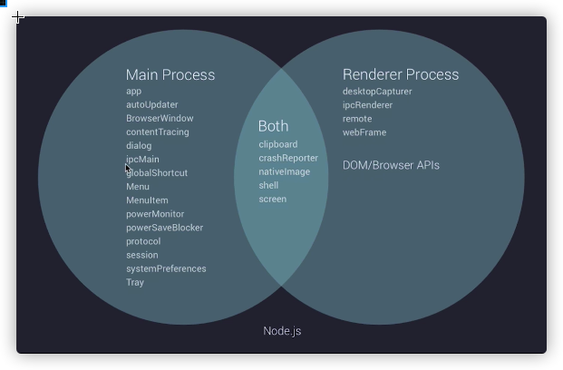

/*
 * @Author: zendu 
 * @Date: 2021-09-02 14:24:37 
 * @Last Modified by: zendu
 * @Last Modified time: 2021-09-02 16:55:19
 */

# 2021-09-02




1. 使用nodemon刷新main.js
```js
"start": "nodemon --watch main.js --exec \"electron .\""
```

2. 安装 devtron 类似于vue-devtools的工具，调试用的
报错，出现：BrowserWindow.addDevToolsExtension is not a function
安装electron老版本 npm i electron@5.0.6 -D


3. 子父进程通信
ipcRenderer  |   ipcMain


4. remote模块实现跨进程通信

在render中调用main的方法

```js
const {BrowserWindow} = require("electron").remote
let win = new BrowserWindow({width: 800,height: 600});
win.loadURL("https://www.baidu.com");
```


5. React
npx 知识点 ls ./node_module/.bin/*

6. Hooks

a. useState 添加函数组件内部状态

```js

const func = ()=>{
    const [like,setLike] = useState(0); 
    return (
        <button onClick={()=>{setLike(like+1)}}>
            {like} 👍
        </button>
    )
}
```

b. Effect hook

无需清除的Effect副作用

useEffect 需要在渲染后执行某个操作

```js
useEffect(()=>{
    document.title = `click ${count} times`
})
```

需要清除的副作用，比如添加DOM事件 / 如果是class 则componentDidMount | componentWillUnmount

```js
const [positions,setPositions] = useState({x:0,y:0});

useEffect(()=>{
    const updateMouse = e=>{
        setPosition({x:e.clientX,y: e.clientY});
    }
    document.addEventListener('click',updateMouse);

    return ()=>{
        // 在销毁组件的时候，清除Effect
        document.removeEventListener('click',updateMouse);
    }
})
```

抽离Hooks
mkdir hooks
touch hooks/useMousePosition.js

```js
import react, { useEffect, useState } from 'react'

const useMousePosition = () => {
    let [position, setPosition] = useState({ x: 0, y: 0 });
    useEffect(() => {
        const updateMouse = e => {
            setPosition({ x: e.clientX, y: e.clientY })
        }
        window.addEventListener("mousemove", updateMouse)

        return () => {
            window.removeEventListener("mousemove", updateMouse);
        }
    })
    return position
}


export default useMousePosition
```

```js
function App() {
  let position = useMousePosition();
  return (
    <div className="App">
          {position.x},{position.y}
    </div>
  );
}
```

控制Effect调用次数


> https://coding.imooc.com/lesson/384.html#mid=28039