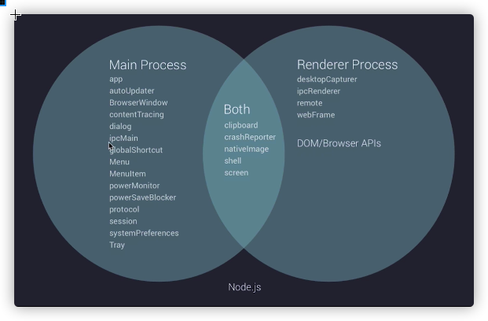

/*
 * @Author: zendu 
 * @Date: 2021-09-02 14:24:37 
 * @Last Modified by: zendu
 * @Last Modified time: 2021-09-02 15:39:20
 */




# 2021-09-02

1. 使用nodemon刷新main.js
```js
"start": "nodemon --watch main.js --exec \"electron .\""
```

2. 安装 devtron 类似于vue-devtools的工具，调试用的
报错，出现：BrowserWindow.addDevToolsExtension is not a function
安装electron老版本 npm i electron@5.0.6 -D

3. 子父进程通信
ipcRenderer  |   ipcMain


4. remote模块实现跨进程通信


